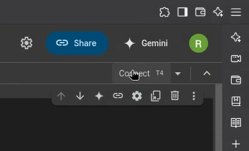
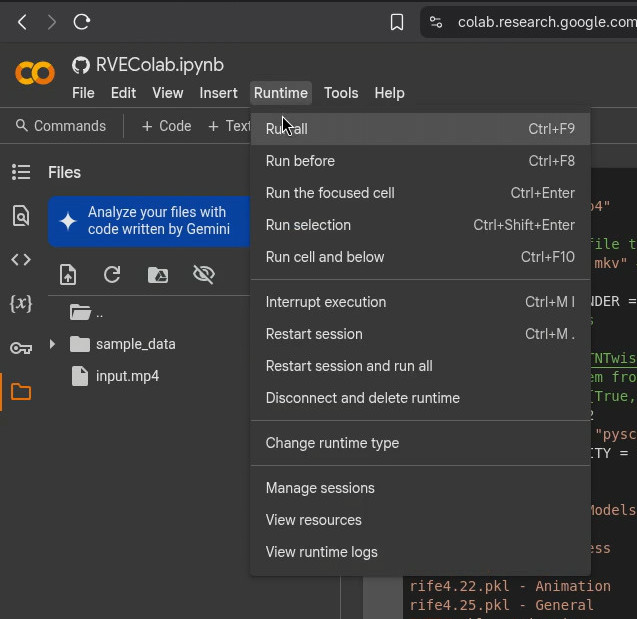
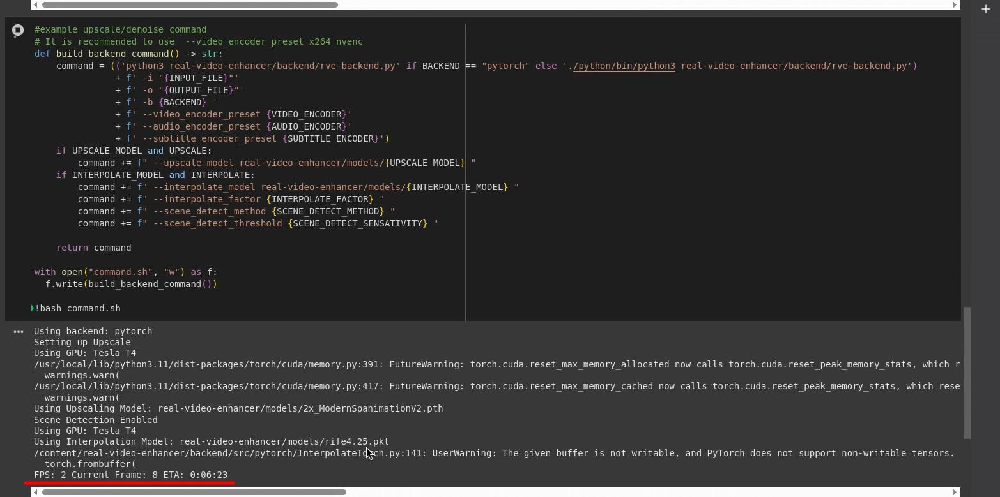
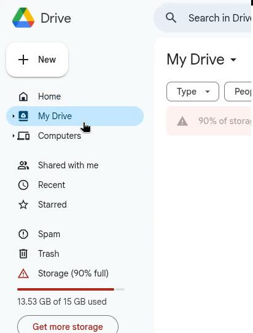
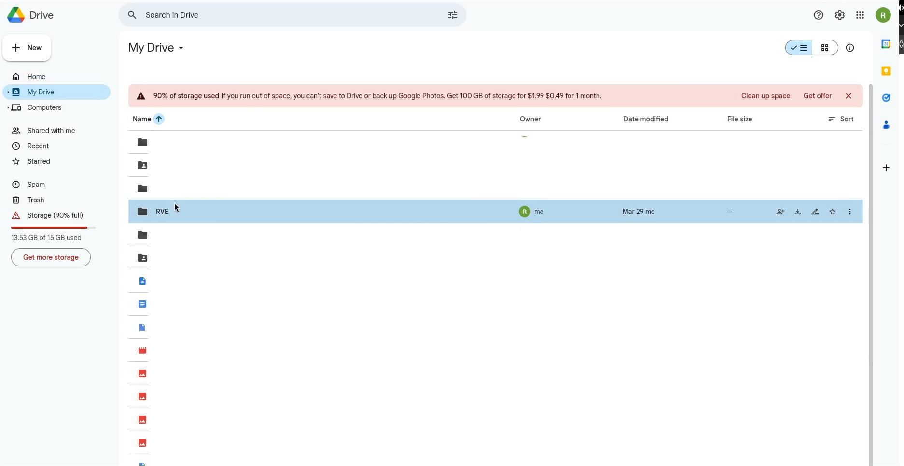
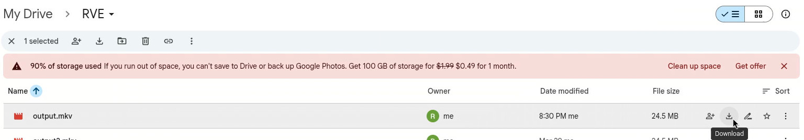

# REAL-Video-Enhancer-Colab

A Google Colab notebook to enhance videos using interpolation and upscaling with [real-video-enhancer](https://github.com/tntwise/real-video-enhancer).

## Tutorial

This guide will walk you through using the [RVEColab.ipynb](RVEColab.ipynb) notebook to enhance your video.

### Prerequisites

1.  A Google Account to use Google Colab and Google Drive.
2.  The video file you want to enhance.

### Setup

1.  **Open the Notebook:** Click the "Open in Colab" badge above (or manually upload [RVEColab.ipynb](RVEColab.ipynb) to Google Colab).
2.  **Upload Video:** Upload your input video file to the Colab environment's root directory (`/content/`). Make sure its filename matches the `INPUT_FILE` variable in the first code cell (default is `input.mp4`).

### Configuration Overview

Before running the notebook, configure the settings in the first code cell (`# File Settings`):

*   `INPUT_FILE`: The name of your uploaded video file.
*   `OUTPUT_FILE`: The desired name for the enhanced output video. It will be saved in a folder named `RVE` in your Google Drive.
*   `KILL_RUNTIME_AFTER_RENDER`: Set to `True` to automatically disconnect the Colab session after processing (saves resources), or `False` to keep it active.
*   `INTERPOLATE`: Set to `True` to enable frame interpolation (increase frame rate).
    *   `INTERPOLATE_FACTOR`: The factor by which to multiply the frame rate (e.g., 2).
    *   `SCENE_DETECT_METHOD`: Method for scene change detection (`pyscenedetect` or `none`).
    *   `SCENE_DETECT_SENSATIVITY`: Threshold for scene detection (lower is more sensitive).
    *   `INTERPOLATE_MODEL`: Choose the interpolation model (see comments for options) or provide a direct download link.
*   `UPSCALE`: Set to `True` to enable video upscaling.
    *   `UPSCALE_MODEL`: Choose the upscaling model (see comments for options) or provide a direct download link.
*   `VIDEO_ENCODER`, `AUDIO_ENCODER`, `SUBTITLE_ENCODER`: FFMpeg settings for the output file. `copy_audio` and `copy_subtitle` are often good defaults if the input has them.
*   `BACKEND`: Processing backend (`pytorch` or `tensorrt`). `tensorrt` might be faster but requires extra setup time.

### Running the Enhancement

1.  **Connect Runtime:** Ensure you are connected to a Colab GPU runtime (Runtime -> Change runtime type, select GPU).
    
2.  **Run Cells:** Execute the notebook cells sequentially from top to bottom (Runtime -> Run all, or click the play button on each cell).
    
3.  **Authorize Google Drive:** When prompted by the cell mounting Google Drive (usually the second code cell), follow the link, choose your Google account, allow access, and copy the authorization code back into the Colab prompt.
4.  **Wait for Processing:** The enhancement process will begin. You can monitor the progress in the cell output. This step can take a long time.
    

### Output

Once the process is complete, the enhanced video file (named according to `OUTPUT_FILE`) will be copied to the `RVE` folder in the root of your Google Drive (`My Drive/RVE/`).

### Notes
*   If `KILL_RUNTIME_AFTER_RENDER` is `True` and copying to Drive fails, you will need to manually download the output file from the Colab `/content/` directory (using the file browser on the left) before the runtime disconnects.
    